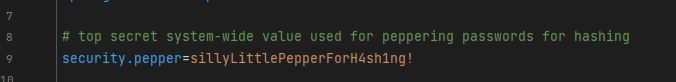

# Implementation

## Password Hashing Implementation

### Requirements

- When registering, the password is saved as a hash in the DB.
- The hash uses salt and pepper.
- When logging in, the password is hashed again and compared with the hash in the database.
- Existing plain text passwords in the DB must be replaced.

### Steps

- Research hashing, salting, and peppering.
- Add Salt and Pepper Hashing to the prepared file, "PasswordEncryptionService.java"
- Testing

The pepper for the hash is saved as an environment variable in application.properties:

This function generates the salt:

Then the password is hashed using this function, making use of the pepper and the generated salt:

The hashing function makes use of PBKDF2, or "Password-based Key Derivation Function", to hash the given password.

## Secret Encryption Implementation

### Requirements

- Secrets in the database must be stored in encrypted form.
- When reading the secrets, they must be decrypted.
- The key should be different for each user.

### Steps

- Research encryption and AES encryption
- Implement AES encryption and decryption using CBC mode and PKCS5 padding.
- Use PBKDF2WithHmacSHA256 to derive a secure key from the password and salt.
- Concatenate the Initialization Vector (IV) with the ciphertext during encryption.
- Extract the IV from the encrypted message during decryption.
- Add encryption logic to the prepared file, "EncryptUtil.java"
- Testing

This function generates the salt:

This function generates a 16-byte initialization vector (IV):

To encrypt data, the following function is used:

This function combines the IV and encrypted data into a single Base64-encoded string for safe storage or transmission.

To decrypt the encrypted Base64-encoded string, this function is used:

The encryption and decryption process uses PBKDF2WithHmacSHA256 to derive the encryption key:

PBKDF2WithHmacSHA256 stands for "Password-Based Key Derivation Function 2 with HMAC using SHA-256", which securely stretches a password into a cryptographic key using salt and multiple iterations.

---

# Theory

## Salt and Pepper Hashing

Hashing is the process of converting data into a fixed-length string of letters and numbers. Data is converted into these fixed-length strings, or hash values, by using a special algorithm called a hash function.

Hashing is used to encrypt sensitive data like passwords in order to keep them secure during transmission over the internet.

The hash function takes the password as input and produces a unique output: the hash value. This hash value is then stored in a database instead of the actual password.

### Salt

Hashing is not foolproof and can still be cracked using rainbow tables. This is why 'salt' can be added - which is a random string of characters that is included in the password before the hashing process. It is then stored alongside the hashed password in the database. This means that even if two people have the same password, their hash values differ from each other.

### Pepper

Another layer of security on top of salting is 'pepper'. Pepper is a random, unique string of characters that is included in the password before hashing, just like salt. But in this case, the pepper is not stored along with the password, but rather separately and is kept secret.

## Further encryption techniques
### PBKDF2
Password-based Key Derivation Function Along with salting and peppering, this algorithm can be used to further increase the security of an application's password encryption. It is a high-level algorithm that internally calls a pseudo-random function to process input (the salted, peppered password).

### PBKDF2WithHmacSHA256
Password-Based Key Derivation Function 2 with HMAC using SHA-256, which securely stretches a password into a cryptographic key using salt and multiple iterations.

